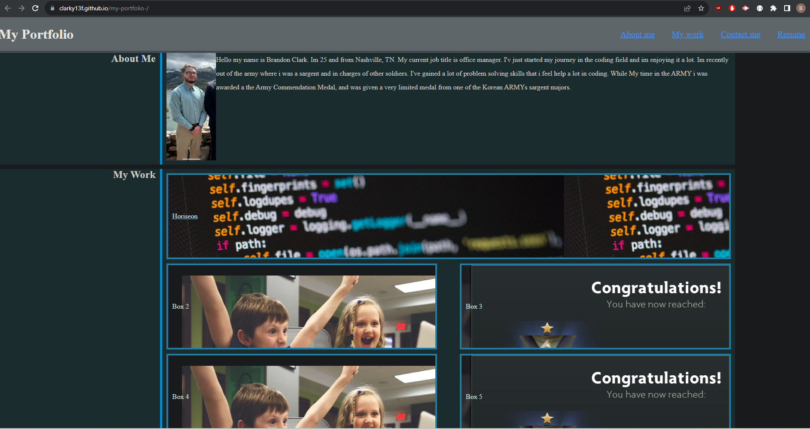

# My portfolio- codeing for challenge 2

# Description: The code that is in my html and css foldersare are use to make a portfolio page for myself.its used to my boxes and word interactive for the viewer

# image: 
![website-img] 

# website link: 

https://clarky13f.github.io/my-portfolio-/

https://github.com/Clarky13F/my-portfolio-